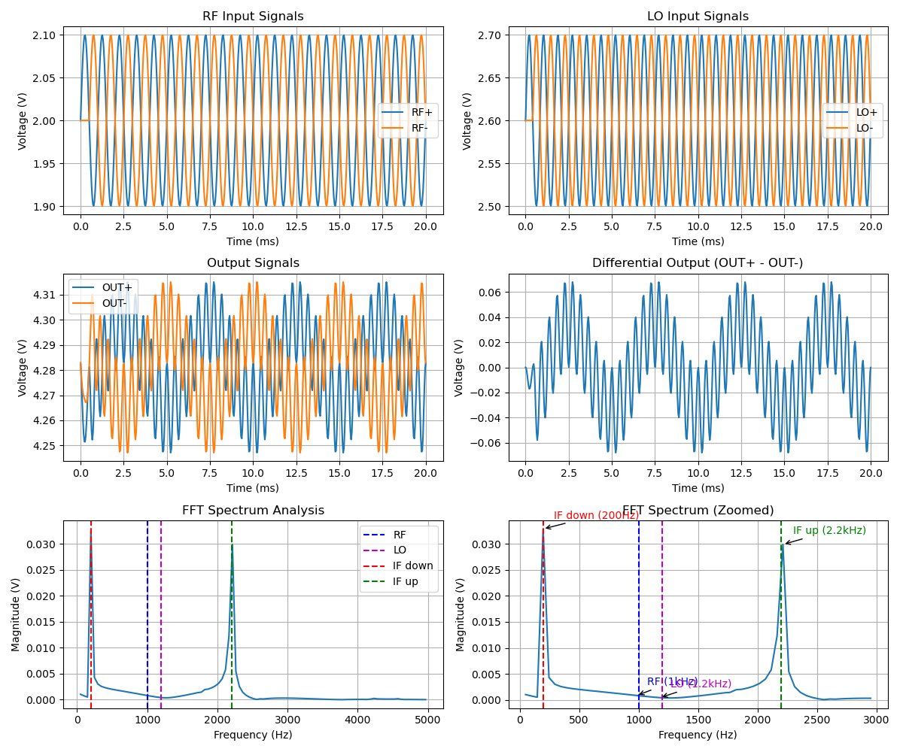
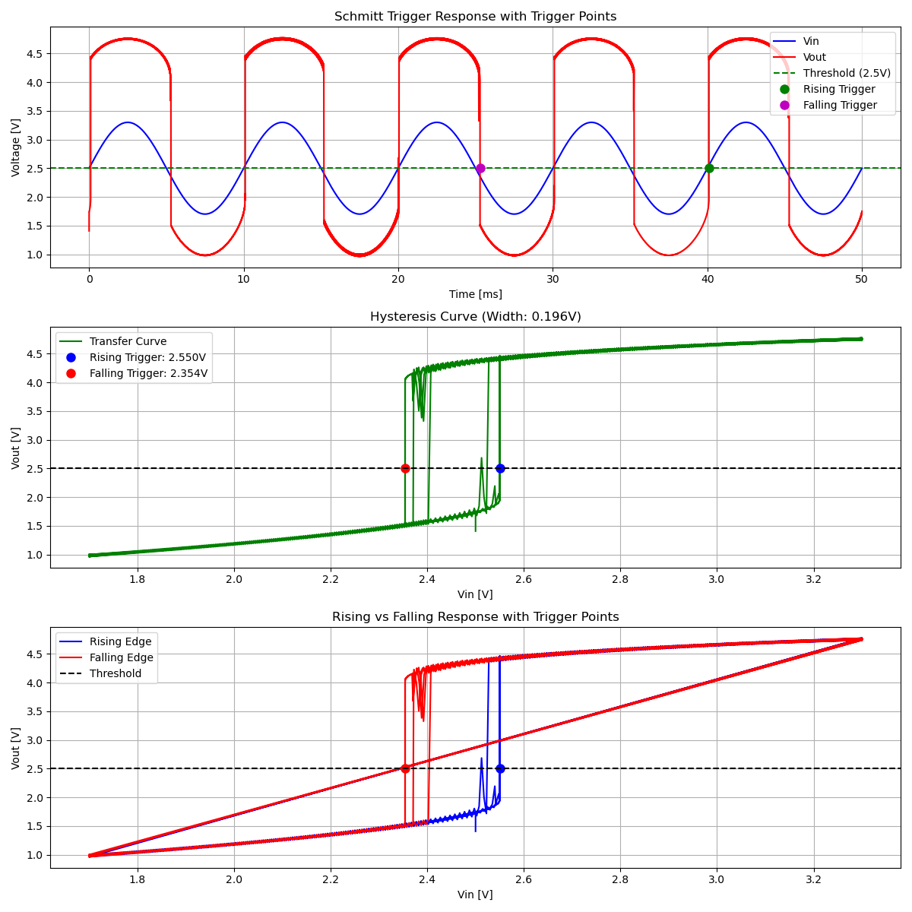
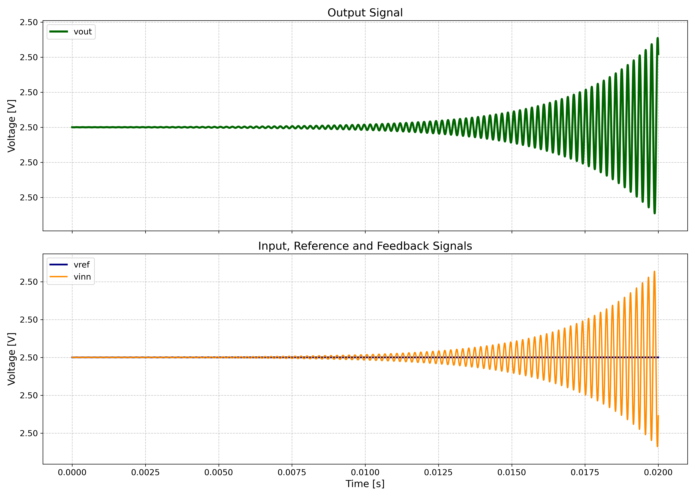
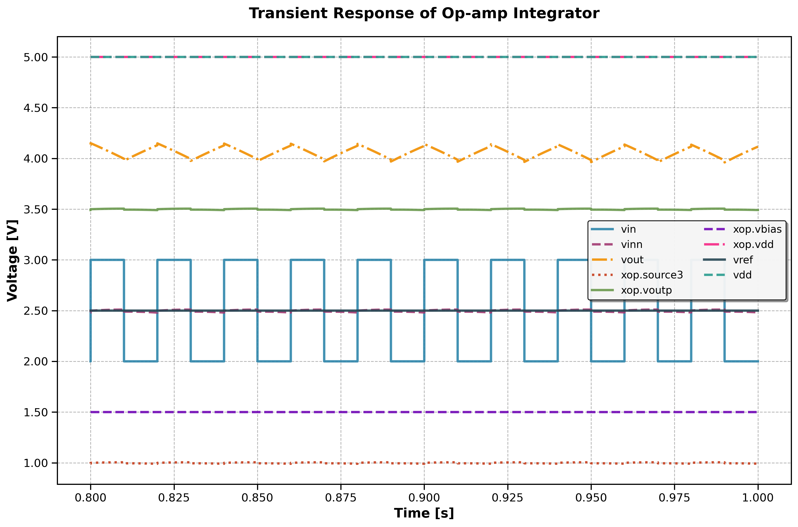
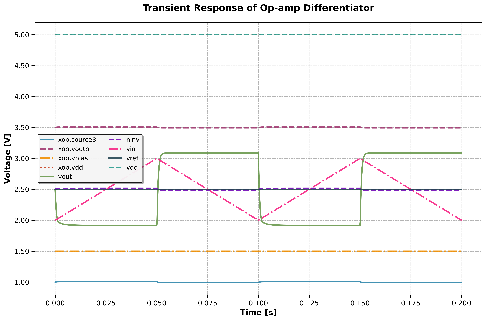
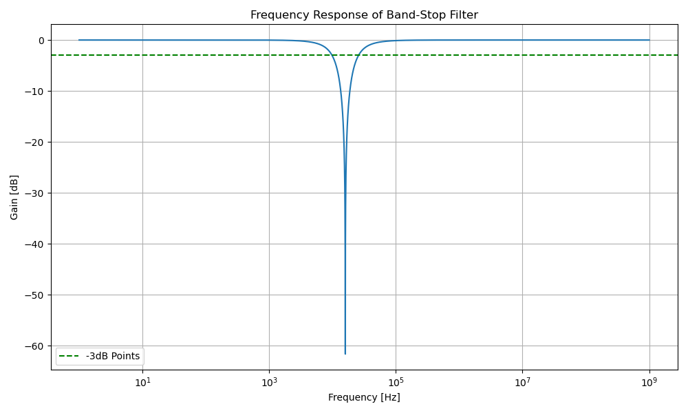
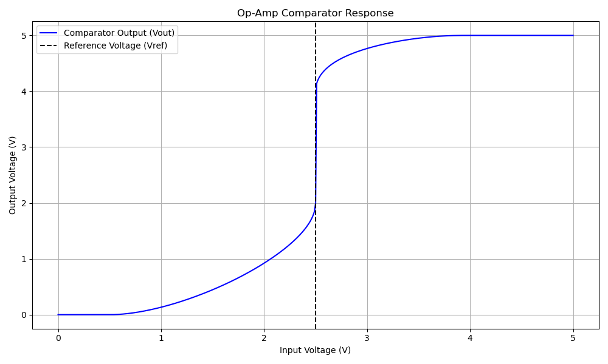

# AnalogCoder-Pro: Unifying Analog Circuit Generation and Optimization via Multi-modal LLMs


[Yao Lai](https://laiyao1.github.io/)<sup>1</sup>, [Souradip Poddar](https://www.linkedin.com/in/souradip-poddar-52376212a/)<sup>2</sup>, [Sungyoung Lee](https://brianlsy98.github.io/)<sup>2</sup>, [Guojin Chen](https://gjchen.me/)<sup>3</sup>, [Mengkang Hu](https://aaron617.github.io/)<sup>1</sup>, [Bei Yu](https://www.cse.cuhk.edu.hk/~byu/)<sup>3</sup>, [David Z. Pan](https://users.ece.utexas.edu/~dpan/)<sup>2</sup>, [Ping Luo](http://luoping.me/)<sup>1</sup>.

<sup>1</sup> The University of Hong Kong,
<sup>2</sup> The University of Texas at Austin,
<sup>3</sup> The Chinese University of Hong Kong.


[[Paper](https://arxiv.org/abs/2508.02518)]

This work is an extension of [AnalogCoder](https://arxiv.org/abs/2405.14918) (AAAI 2025).
# Overview

- **Challenge**: Analog front-end design still relies heavily on expert intuition and iterative simulations, with limited automation.  
- **Solution**: **AnalogCoder-Pro** — a unified multimodal LLM-based framework for analog design automation.  
- **Key Features**:  
  - Joint **circuit topology generation** and **device sizing optimization**  
  - Automatic generation of **performance-specific schematic netlists**  
  - **Multimodal diagnosis & repair** using specifications and waveform images  
  - Automated extraction of design parameters and parameter space formulation  
- **Outcome**: Improves design success rate and circuit performance, enabling an end-to-end automated workflow.  


# Project Checklist

- [ ] Update the the LLM run scripts.
- [ ] Update the sample waveform figures.

# Benchmark
- Task descriptions are in `problem_set.tsv`.
- Sample circuits are in directory `sample_design`.
- Test-benches are in directory `problem_check`.

# Waveform Examples

Here are example waveforms for different circuit types, demonstrating the appropriate analysis methods for each design.

---

## Mixer
**Analysis Type:** Transient + FFT Spectrum

<div align="center">
  
</div>

---

## Schmitt Trigger  
**Analysis Type:** Transient + DC Transfer

<div align="center">
  
</div>

---

## Oscillator
**Analysis Type:** Transient

<div align="center">
  
</div>

---

## Integrator
**Analysis Type:** Transient

<div align="center">
  
</div>

---

## Differentiator
**Analysis Type:** Transient

<div align="center">
  
</div>

---

## BandStop Filter
**Analysis Type:** AC

<div align="center">
  
</div>

---

## Comparator
**Analysis Type:** DC Sweep

<div align="center">
  
</div>


# Citation
If you find our work beneficial, we would be grateful if you considered citing our paper.


```
@misc{lai2025analogcoderpro,
      title={AnalogCoder-Pro: Unifying Analog Circuit Generation and Optimization via Multi-modal LLMs}, 
      author={Yao Lai and Souradip Poddar and Sungyoung Lee and Guojin Chen and Mengkang Hu and Bei Yu and Ping Luo and David Z. Pan},
      year={2025},
      archivePrefix={arXiv},
      primaryClass={cs.LG},
}
```
