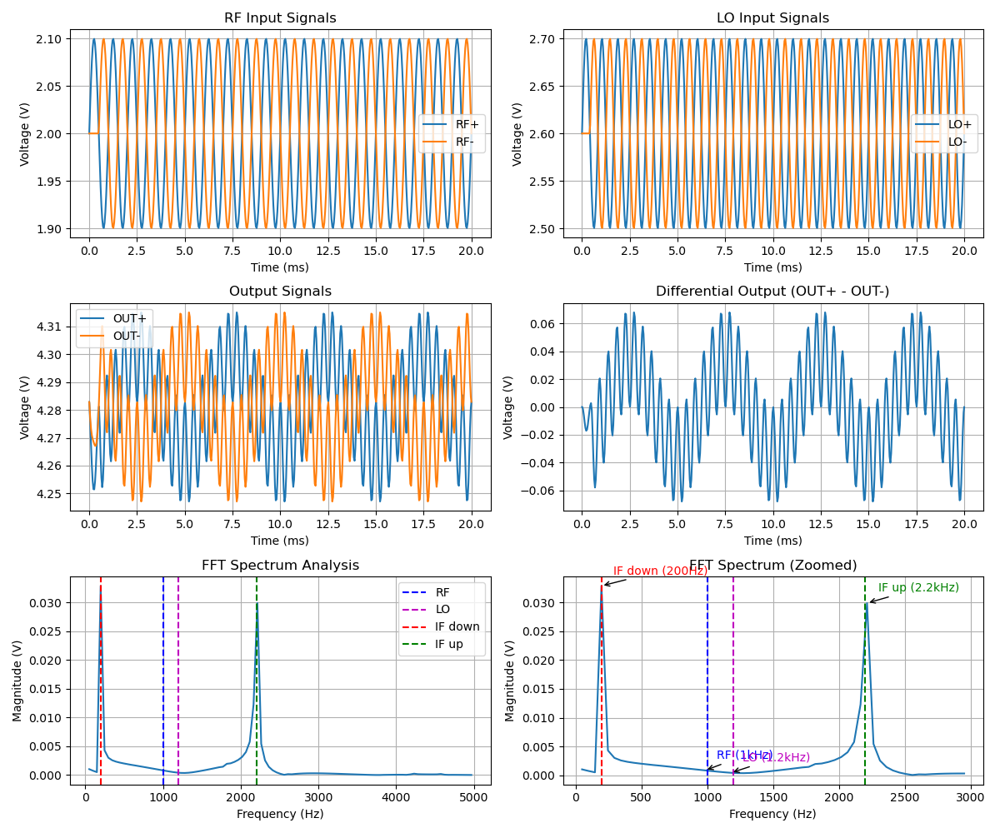
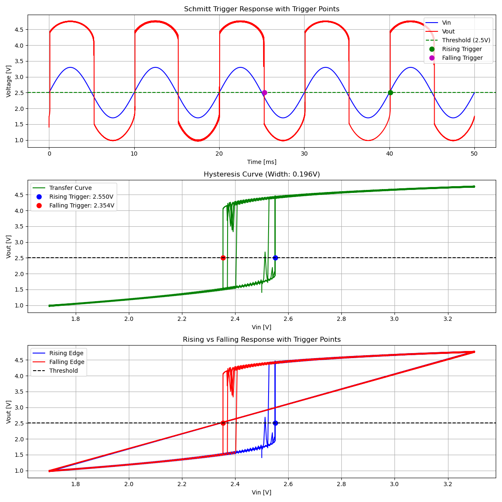
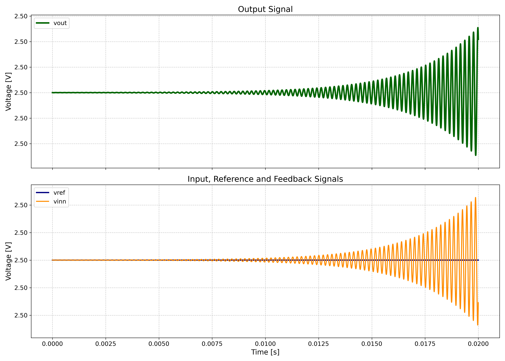
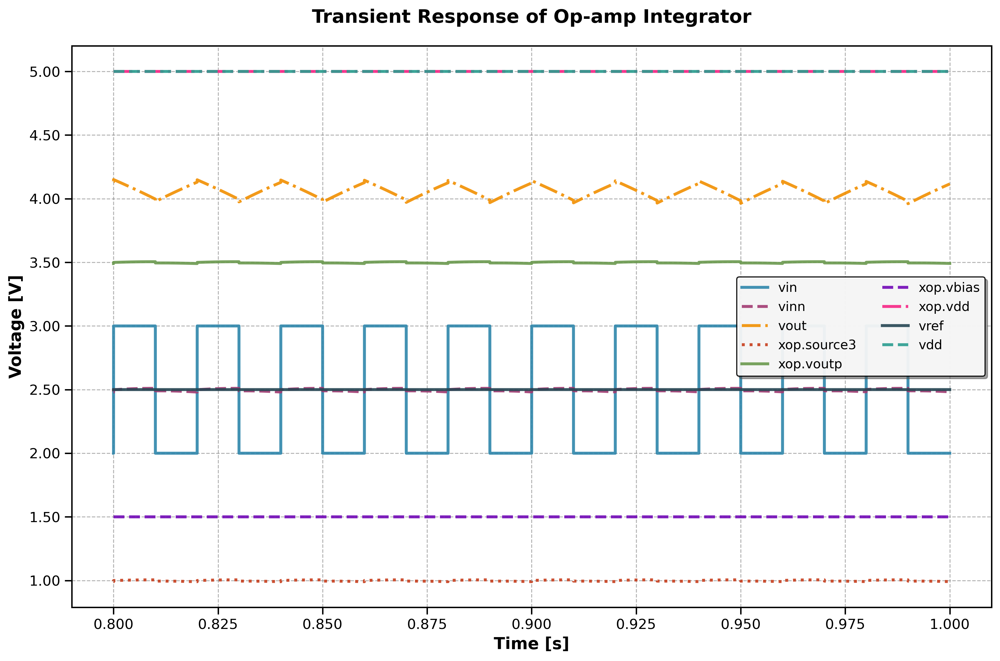
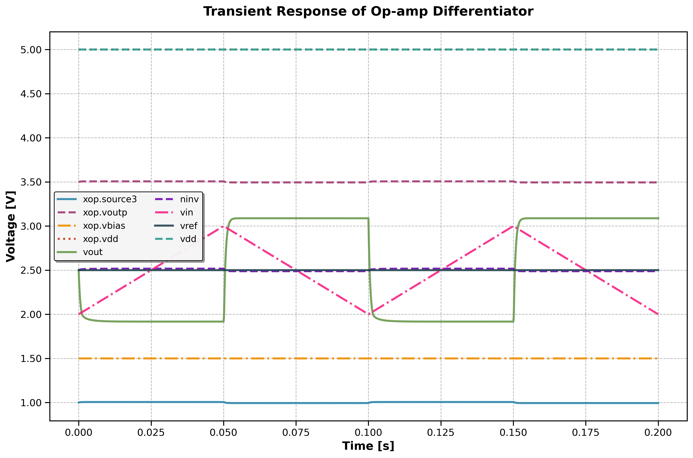
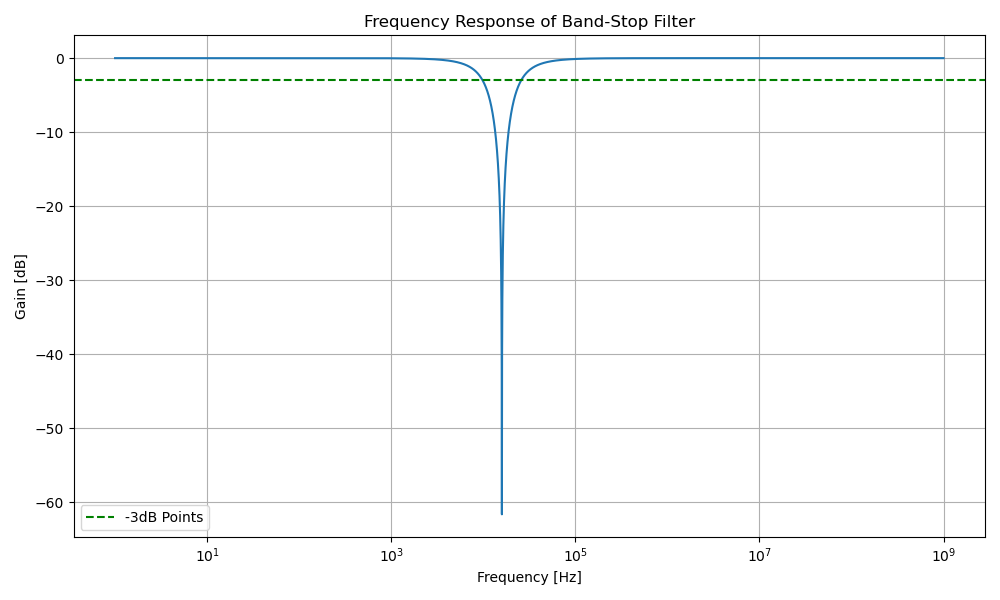
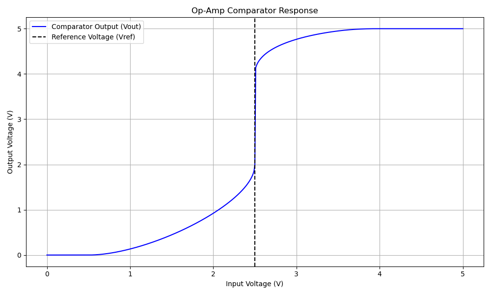

# AnalogCoder-Pro: Unifying Analog Circuit Generation and Optimization via Multi-modal LLMs


[Yao Lai](https://laiyao1.github.io/)<sup>1</sup>, [Souradip Poddar](https://www.linkedin.com/in/souradip-poddar-52376212a/)<sup>2</sup>, [Sungyoung Lee](https://brianlsy98.github.io/)<sup>2</sup>, [Guojin Chen](https://gjchen.me/)<sup>3</sup>, [Mengkang Hu](https://aaron617.github.io/)<sup>1</sup>, [Bei Yu](https://www.cse.cuhk.edu.hk/~byu/)<sup>3</sup>, [Ping Luo](http://luoping.me/)<sup>1</sup>, [David Z. Pan](https://users.ece.utexas.edu/~dpan/)<sup>2</sup>.

<sup>1</sup> The University of Hong Kong,
<sup>2</sup> The University of Texas at Austin,
<sup>3</sup> The Chinese University of Hong Kong.


[[Paper](https://ieeexplore.ieee.org/document/11432899)]

This work is an extension of [AnalogCoder](https://arxiv.org/abs/2405.14918) (AAAI 2025) [[repo](https://github.com/laiyao1/AnalogCoder)].

# 🔔 Updates

- Our work has been accepted in **IEEE Transactions on Computer-Aided Design of Integrated Circuits and Systems (TCAD) 2026**! 🎉 


# 🎯 Overview

- **Challenge**: Analog front-end design still relies heavily on expert intuition and iterative simulations, with limited automation.  
- **Solution**: **AnalogCoder-Pro** — a unified multimodal LLM-based framework for analog design automation.  
- **Key Features**:  
  - Joint **circuit topology generation** and **device sizing optimization**  
  - Automatic generation of **performance-specific schematic netlists**  
  - **Multimodal diagnosis & repair** using specifications and waveform images  
  - Automated extraction of design parameters and parameter space formulation  
- **Outcome**: Improves design success rate and circuit performance, enabling an end-to-end automated workflow.  


# ✅ Project Checklist

- [x] Update the LLM run scripts.
- [x] Update the sample waveform figures.
- [ ] Update the BO optimization.
- [ ] Update all ablation study prompts.

# 🧪 Benchmark
- Task descriptions are in the file `problem_set.tsv`.
- Sample circuits are in the `sample_design` directory.
- Test benches are in the `problem_check` directory.

# Environment Settings

```
git clone git@github.com:laiyao1/AnalogCoderPro.git
cd AnalogCoderPro
conda create -n analog python==3.10
conda activate analog
pip install matplotlib pandas numpy scipy openai
conda install -c conda-forge ngspice -y
conda install -c conda-forge pyspice
```

# Quick Start
```
python run.py --task_id=19 --num_per_task=3  --model=gpt-5-mini --api_key="[API_KEY]" --base_url="[BASE_URL]"
```
This script will attempt Mixer generation 3 times.
The mapping of task IDs can be found in `problem_set.tsv`.

# 📊 Waveform Gallery

Here are example waveforms for different circuit types, demonstrating the appropriate analysis methods for each design.

<table>
<colgroup><col style="width:50%"><col style="width:50%"></colgroup>
<tr>
<td align="center"><strong>Mixer</strong> — Transient + FFT Spectrum</td>
<td align="center"><strong>Schmitt Trigger</strong> — Transient + DC Transfer</td>
</tr>
<tr>
<td align="center"></td>
<td align="center"></td>
</tr>
<tr>
<td align="center"><strong>Oscillator</strong> — Transient</td>
<td align="center"><strong>Integrator</strong> — Transient</td>
</tr>
<tr>
<td align="center"></td>
<td align="center"></td>
</tr>
<tr>
<td align="center"><strong>Differentiator</strong> — Transient</td>
<td align="center"><strong>BandStop Filter</strong> — AC</td>
</tr>
<tr>
<td align="center"></td>
<td align="center"></td>
</tr>
<tr>
<td align="center"><strong>Comparator</strong> — DC Sweep</td>
<td align="center"></td>
</tr>
<tr>
<td align="center"></td>
<td align="center"></td>
</tr>
</table>


# 📚 Citation
If you find our work useful, we would appreciate a citation of our paper.


```

@article{lai2025analogcoder,
    title={AnalogCoder: Analog Circuit Design via Training-Free Code Generation},
    volume={39},
    DOI={10.1609/aaai.v39i1.32016},
    number={1},
    journal={Proceedings of the AAAI Conference on Artificial Intelligence},
    author={Lai, Yao and Lee, Sungyoung and Chen, Guojin and Poddar, Souradip and Hu, Mengkang and Pan, David Z. and Luo, Ping},
    year={2025},
    pages={379-387}
}

@article{lai2026analogcoderpro,
    author={Lai, Yao and Poddar, Souradip and Lee, Sungyoung and Chen, Guojin and Hu, Mengkang and Yu, Bei and Luo, Ping and Pan, David Z.},
    journal={IEEE Transactions on Computer-Aided Design of Integrated Circuits and Systems}, 
    title={AnalogCoder-Pro: Unifying Analog Circuit Generation and Optimization via Multi-modal LLMs}, 
    year={2026},
    doi={10.1109/TCAD.2026.3673493}
}

```
